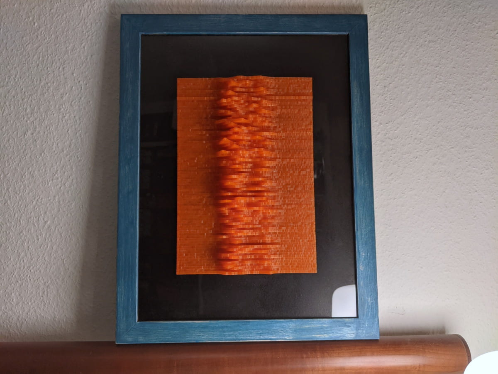
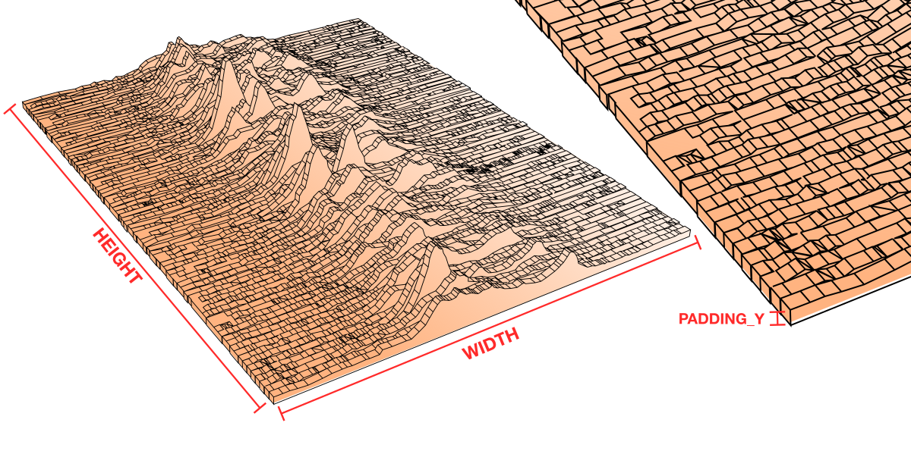
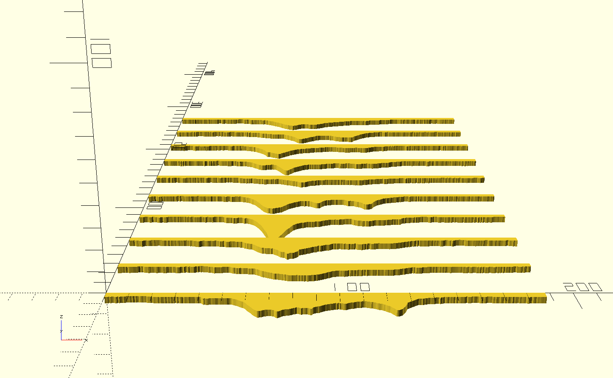

This is a generator for a 3d-printable visualization of the first discovered
radio pulsar, [PSR B1919+21][0]. It was discovered by [Jocelyn Bell Burnell][1]
in 1967.  
The visualization is a stacked line graph. It's also the cover of Joy
Division's debut album [Unknown Pleasures][2].

Each pulse is a separate printed part that can be glued together to make the
full piece. The generator will create several STL files to print all the parts
in batches.

Ready-made STl files are available on Thingiverse:  
https://www.thingiverse.com/thing:5181661



## Prerequisites

 - Git (optional if you download the Zip file instead)
 - [Node.js][3]
 - [OpenSCAD][4]

Note that this generator has only been tested on Linux.

## Generate the STL Files

Clone, fork, or download this repository:

```sh
git clone https://github.com/maxkueng/PSR-B1919-21.git
```

Change to the repository directory and nstall the Node.js dependencies:

```sh
cd ./PSR-B1919-21
npm install
```

Make sure the generator script is executable:

```sh
chmod +x ./generate.js
```

And then run the generator:

```sh
./generate.js
```

This will generate the following folder structure:

```
out/
├─ batch_scad/
│  ├─ batch_00.scad
│  ├─ batch_01.scad
│  └─ ...
├─ batch_stl/
│  ├─ batch_00.stl
│  ├─ batch_01.stl
│  └─ ...
├─ dxf/
│  ├─ 00.dxf
│  ├─ 01.dxf
│  └─ ...
└─ stl/
   ├─ 00.stl
   ├─ 01.stl
   └─ ...
```

 - `out/batch_scad` contains temporary OpenSCAD files used to create the batch
   STLs.
 - `out/batch_stl` contains the printing batches. **These are the files you
   want to print!**
 - `out/dxf` contains a DXF file for each pulse. They are used to generate the
   parts with OpenSCAD but can also be used to laser-cut the project instead.
 - `out/stl` contains separate STL for each part in case you want to arrange
   them yourself in the slicer.

*Note that the numbering of the pulses is reversed! The part numbering is just for easier scripting and assembly.*

## Customization

Open the `generate.js` file in a code editor and mofify the values in the
configuration section.

 - `OPENSCAD_PATH`: Path to the OpenSCAD executable. This only needs to be changed if OpenSCAD can't be found through the `PATH` environment variable.

 - `INPUT`: Path to the input dataset. Must be a CSV without column names.

 - `OUTPUT_DIR`: Path to the output directory.

 - `LAYER_HEIGHT`: Print layer height. This will be used to round the extrusion height of the parts.

 - `HEIGHT`: Overall height in millimeter. This value will be rounded by LAYER_HEIGHT and is used to calculate the extrusion height of the individual parts.

 - `WIDTH`: Overall width in millimeter.

 - `X_Y_RELATION`: The relation between X and Y. Reduce this value to increase the height (Y axis) of the dataset to get taller spikes in the graph.

 - `PADDING_Y`: Some extra space at the bottom of the graph. This raises the Y axis to make a thicker base.

 - `BED_Y`: Available space of the print surface in the Y direction. This is used to figure out how many parts to place on a print batch.
 
 
 
 ## Assembly

 All parts and meant to be glued together by stacking the parts behind each
 other from the lowest number to the highest. The parts in each batch are
 arranged from bottom to top in the Y direction. Each batch goes behind the
 previous batch.
 
 
 
 ## License

The generator script is licensed under MIT License.  
Copyright (c) 2022 Max Kueng (http://maxkueng.com/)

The pulsar.csv data is from [Borgar's Gist][5] and is licensed under Creative Commons BY-NC-SA 4.0.
 

[0]: https://en.wikipedia.org/wiki/PSR_B1919%2B21
[1]: https://en.wikipedia.org/wiki/Jocelyn_Bell_Burnell
[2]: https://www.discogs.com/master/4805-Joy-Division-Unknown-Pleasures
[3]: https://nodejs.org/en/
[4]: https://openscad.org/
[5]: https://gist.github.com/borgar/31c1e476b8e92a11d7e9
[6]: https://creativecommons.org/licenses/by-nc-sa/4.0/
